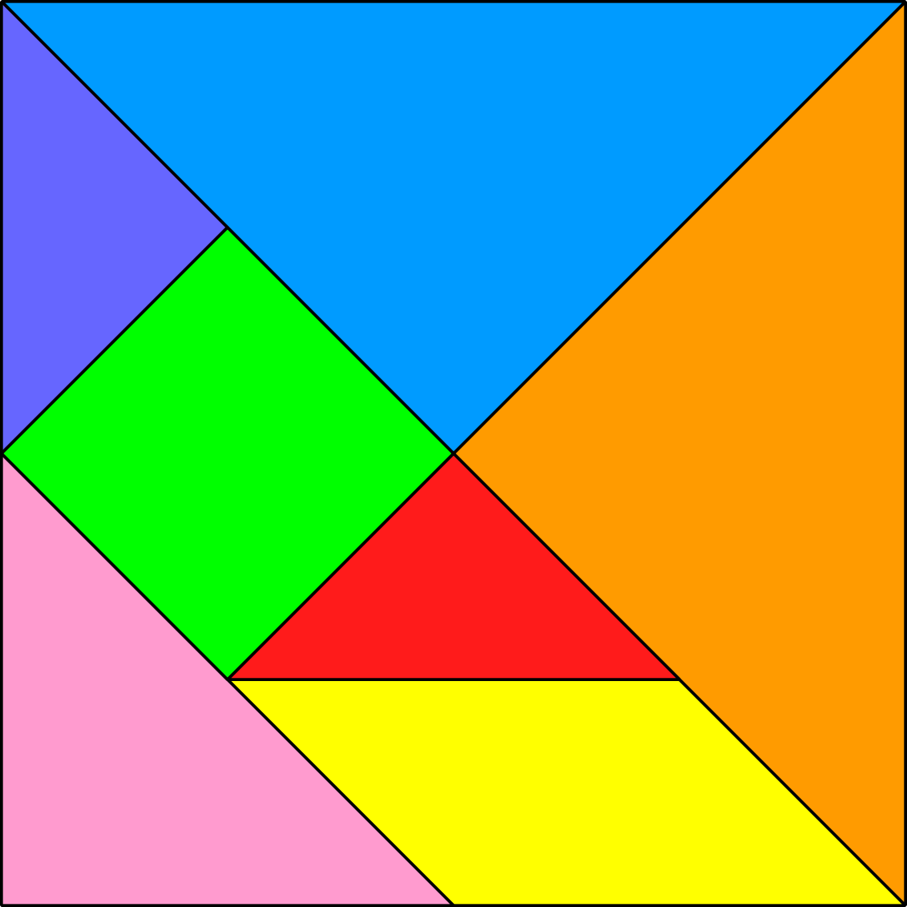

# CGRA

These are the pratical exercises done in the Graphical Computing subject at FEUP. 

## How to execute a file
To visualize the exercises is necessary to run a server at the folder of the exercise.  
To run the server, execute the command: 
`python -m http.server 8080`

## Exercises

|Exercises | Text [PT]| Text [EN]
|---|---|---|
|[Class_01](ex1/)| [Here](https://github.com/Jumaruba/CGRA/blob/master/ex1/Text/TP1%20-%20Setup%20e%20GUI.pdf)| [Here](https://github.com/Jumaruba/CGRA/blob/master/ex1/Text/TP1%20-%20Setup%20and%20GUI(en).pdf) |
|[Class_02](ex2/)| [Here](https://github.com/Jumaruba/CGRA/blob/master/ex2/Text/TP2%20-%20Geometria%20e%20Transforma%C3%A7%C3%B5es.pdf)| [Here](https://github.com/Jumaruba/CGRA/blob/master/ex2/Text/TP2%20-%20Geometry%20and%20Transformations.pdf)|
|[Class_03](ex3/)| [Here](https://github.com/Jumaruba/MIEIC_CGRA/blob/master/ex3/TP3%20-%20Ilumina%C3%A7%C3%A3o%20e%20Materiais.pdf)| [Here](https://github.com/Jumaruba/MIEIC_CGRA/blob/master/ex3/TP3%20-%20Lighting%20and%20Materials.pdf)| 
|[Class_04](ex4/) | [Here](ex4/TP4-AplicacaoDeTexturas.pdf) | [Here](ex4/TP4-ApplicationOfTextures.pdf) | 
|[Class_05](ex5/) | [Here](ex4/ex5/TP5-Shaders.pdf) | [Here](ex5/TP5-Shaders(Englishversion).pdf) | 

# Class 01
Class for creating geometric forms in WebGl. 

# Class 02 
The second class is consisted of two exercises:   
## 1st exercise
Concepts of traslation, scale and rotation were applied in polygons in WebGl in order to build a tangram.  

.png)

## 2nd exercise
The goal of the second exercise is creating a cube with interligate triangles. Consult the text for more information.   
.png)

# Class 03 
The third class is cosisted of two main exercises:  
## 1st exercise
Add normals to the cube and wood "color" to it.  
 

## 2nd exercise
Apply color (not textures) to the tangram
  

## Class 04 
In this class, the students have learned how to apply textures to objects.  
## 1st exercise
Apply texture to tangram from the given image  
   
   
## 2nd exercise
Apply minecraft texture to a cube  
 

## Class 05 
Shader application in water. __Click__ on the image to watch the video on youtube! 
  

And we have also worked on shades like this one: 

 

